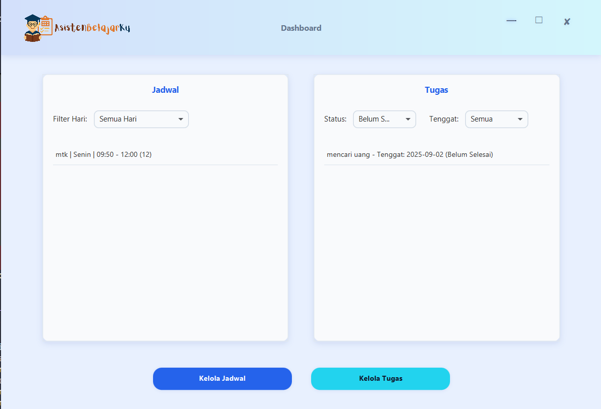
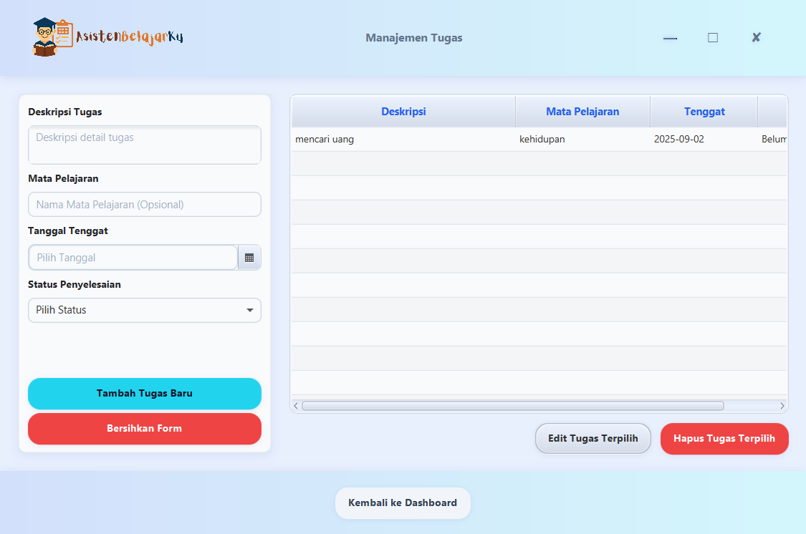

<div align="center">
     
</div>

## 📝 Deskripsi Singkat Proyek

**AsistenBelajarKu** adalah aplikasi desktop berbasis JavaFX yang dirancang untuk membantu pelajar dalam mengelola jadwal pelajaran dan tugas akademik mereka. Aplikasi ini memungkinkan pengguna untuk mencatat, mengatur, dan melacak kegiatan belajar secara efisien melalui antarmuka yang interaktif dan ramah pengguna.

Aplikasi ini dibuat sebagai Proyek Akhir mata kuliah **Pemrograman Berorientasi Objek**, dengan fokus pada penerapan prinsip OOP secara menyeluruh.

## 👥 Tim Pengembang

- **[IMAM DZAQHOIR](https://github.com/ShinZeleo)** (`H071241048`)
- **[RYAN FIRMANSYAH](https://github.com/Ryannfirmansyah)** (`H071241082`)
- **[AKRAM ALFADLI TAMIR](https://github.com/Akram-Dwf)** (`H071241076`)

## 🎨 Tema

**Pendidikan**: Aplikasi untuk manajemen jadwal dan tugas siswa.

## ✨ Fitur Aplikasi

- 📅 Manajemen jadwal mingguan pelajaran (CRUD).
- 📝 Pencatatan dan pelacakan tugas akademik.
- 🔍 Filter tampilan berdasarkan hari dan status tugas.
- 💾 Penyimpanan data lokal dalam format JSON.
- 🎨 Tampilan antarmuka yang modern dan intuitif.

## 🔄 Alur Kerja Aplikasi

1. **Beranda**: Menampilkan ringkasan jadwal hari ini dan tugas mendesak.
2. **Manajemen Jadwal**: Tambah, ubah, atau hapus sesi pelajaran mingguan.
3. **Manajemen Tugas**: Catat tugas baru, ubah status, atau hapus tugas.
4. **Filter**: Tampilkan tugas berdasarkan tenggat waktu atau status.
5. **Penyimpanan**: Semua data disimpan dalam file `asisten_belajar_data.json`.

## 🛠️ Teknologi dan Library

- **Bahasa**: Java
- **Framework UI**: JavaFX
- **Build Tool**: Gradle
- **Library**:
  - **Jackson**: Untuk serialisasi dan deserialisasi data dari/ke format JSON.

## ⚙️ Cara Menjalankan Aplikasi

Aplikasi ini dibangun menggunakan Gradle. Pastikan Anda memiliki JDK (Java Development Kit) versi 21 atau yang lebih baru terpasang di sistem Anda.

1.  **Clone Repository:**

    ```bash
    git clone https://github.com/ShinZeleo/AsistenBelajarKu.git
    ```

2.  **Pindah ke Direktori Proyek:**

    ```bash
    cd AsistenBelajarKu
    ```

3.  **Jalankan Aplikasi menggunakan Gradle Wrapper:**

    - Di Windows (gunakan Command Prompt atau PowerShell):
      ```bash
      .\gradlew run
      ```
    - Di macOS atau Linux (gunakan Terminal):
      ```bash
      ./gradlew run
      ```

Gradle akan secara otomatis mengunduh semua dependensi yang dibutuhkan dan menjalankan aplikasi.

## 🏛️ Struktur Kode dan Penerapan OOP

Struktur proyek ini dirancang untuk menerapkan prinsip-prinsip Pemrograman Berorientasi Objek (OOP) secara efektif.

### Struktur Paket dan Class

| Package/Class    | Deskripsi                                                                   |
| ---------------- | --------------------------------------------------------------------------- |
| `App`            | Kelas utama yang menjalankan aplikasi JavaFX.                               |
| `controller`     | Menangani interaksi UI dan logika aksi pengguna.                            |
| `model`          | Menyimpan struktur data seperti `Tugas`, `JadwalSesi`, dan `MataPelajaran`. |
| `service`        | Berisi logika layanan seperti penyimpanan data dan manipulasi objek.        |
| `resources/fxml` | Menyimpan file tampilan (FXML) untuk UI.                                    |
| `resources/css`  | Menyimpan file styling CSS untuk tampilan aplikasi.                         |

### Struktur Folder

```
AsistenBelajarKu/
├── build.gradle              // Konfigurasi Gradle
├── src/
│   ├── main/
│   │   ├── java/
│   │   │   └── asistenbelajarku/
│   │   │       ├── App.java          // Kelas utama aplikasi
│   │   │       ├── controller/     // Berisi kelas-kelas Controller (Imam)
│   │   │       ├── model/          // Berisi kelas-kelas Model (Akram)
│   │   │       └── service/        // Berisi kelas-kelas Service (Ryan)
│   │   └── resources/
│   │       ├── fxml/             // Berisi file FXML untuk UI
│   │       └── css/              // Berisi file CSS untuk styling
├── asisten_belajar_data.json // File penyimpanan data
└── README.md                 // Dokumentasi ini
```

## Implementasi OOP

| Pilar OOP         | Penerapan                                                                                 |
| ----------------- | ----------------------------------------------------------------------------------------- |
| **Encapsulation** | Field bersifat `private`, akses melalui getter dan setter.                                |
| **Inheritance**   | `Tugas` dan `JadwalSesi` mewarisi dari `EntitasAkademik`.                                 |
| **Abstraction**   | `EntitasAkademik` sebagai kelas abstrak, `iPenyimpananService` sebagai interface layanan. |
| **Polymorphism**  | Daftar `List<EntitasAkademik>` berisi berbagai objek yang diproses secara dinamis.        |

### ✍️Penjelasan Penerapan 4 Pilar OOP

1.  **Encapsulation:**

    - Prinsip ini diterapkan pada semua kelas di _package_ `model` (misalnya `Tugas.java`, `JadwalSesi.java`, `MataPelajaran.java`).
    - Semua atribut (fields) dideklarasikan sebagai `private` untuk menyembunyikan data.
    - Akses ke atribut-atribut tersebut hanya bisa dilakukan melalui metode publik (public getters dan setters), yang memungkinkan adanya validasi dan kontrol terhadap data.

2.  **Inheritance:**

    - Struktur pewarisan dibuat dengan kelas abstrak `EntitasAkademik.java`.
    - Kelas `Tugas.java` dan `JadwalSesi.java` mewarisi (`extends`) dari `EntitasAkademik`. Ini memungkinkan mereka untuk mewarisi properti umum seperti `namaDeskriptif` dan `tanggalDibuat`, sehingga mengurangi duplikasi kode.
    - Ini adalah penerapan pewarisan yang dibuat sendiri dan bukan pewarisan dari kelas JavaFX, sesuai dengan ketentuan proyek.

3.  **Abstraction:**

    - **Kelas Abstrak**: `EntitasAkademik.java` adalah kelas abstrak yang mendefinisikan "template" untuk semua entitas akademik. Ia memiliki metode abstrak seperti `getJenisEntitas()` dan `getRingkasanTampilan()` yang harus diimplementasikan oleh setiap kelas turunannya.
    - **Interface**: `iPenyimpananService.java` adalah sebuah _interface_ yang mendefinisikan "kontrak" untuk layanan penyimpanan. Ia menentukan metode apa yang harus dimiliki oleh kelas penyimpanan (`simpanSemuaData`, `muatSemuaData`) tanpa peduli bagaimana cara penyimpanannya (misalnya, ke JSON, database, dll.). `PenyimpananService.java` adalah implementasi konkret dari _interface_ ini.

4.  **Polymorphism:**

    - **Melalui Pewarisan**: Jika kita memiliki `List<EntitasAkademik>`, kita bisa memasukkan objek `Tugas` dan `JadwalSesi` ke dalamnya. Saat kita memanggil metode `getRingkasanTampilan()` pada setiap item di list tersebut, Java akan secara otomatis memanggil versi metode yang benar sesuai dengan tipe objeknya (versi `Tugas` atau versi `JadwalSesi`).
    - **Melalui Interface**: _Controller_ berinteraksi dengan `iPenyimpananService` tanpa perlu tahu apakah implementasi di belakangnya adalah `PenyimpananService` (yang menyimpan ke JSON) atau implementasi lain di masa depan. Ini membuat kode lebih fleksibel.

## 👥 Pembagian Tugas per Anggota

| Nama Anggota | Tugas Utama                                                             |
| ------------ | ----------------------------------------------------------------------- |
| **Imam**     | Desain UI (FXML, CSS) & Logika Controller (`DashboardController`, dll.) |
| **Ryan**     | Logika Aplikasi (`App.java`), Service (`PenyimpananService`, dll.)      |
| **Akram**    | Desain & Implementasi Model OOP (`EntitasAkademik`, `Tugas`, dll.)      |

## 🖼️ Tampilan Aplikasi

Berikut adalah beberapa _screenshot_ dari aplikasi "AsistenBelajarKu":

### Dashboard Utama



### Manajemen Jadwal


### Manajemen Tugas



## 📂 Catatan Tambahan

- Semua file `.java` berada dalam struktur paket `asistenbelajarku`.
- File data disimpan secara lokal dan akan tetap tersedia saat aplikasi dibuka kembali.
- Fitur validasi dan filter menjadikan aplikasi lebih efisien dan mudah digunakan.

## 📄 Lisensi

Proyek ini dibuat untuk tujuan pembelajaran dan bebas digunakan, dimodifikasi, dan dikembangkan lebih lanjut.

**_Salam hangat dari Tim AsistenBelajarKu._**
